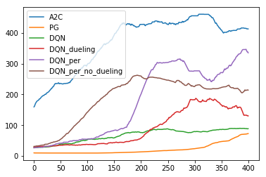

# Deep_RL_algorithms

Basic Pytorch implementations of common algorithms (Vanilla DQN, Actor Critic, Policy Gradient) used in Deep Reinfocement Learning
* For the sake simplicity all of the examples are evaluated "Cartpole-v0" environment.
## Comparison of reward plots:

